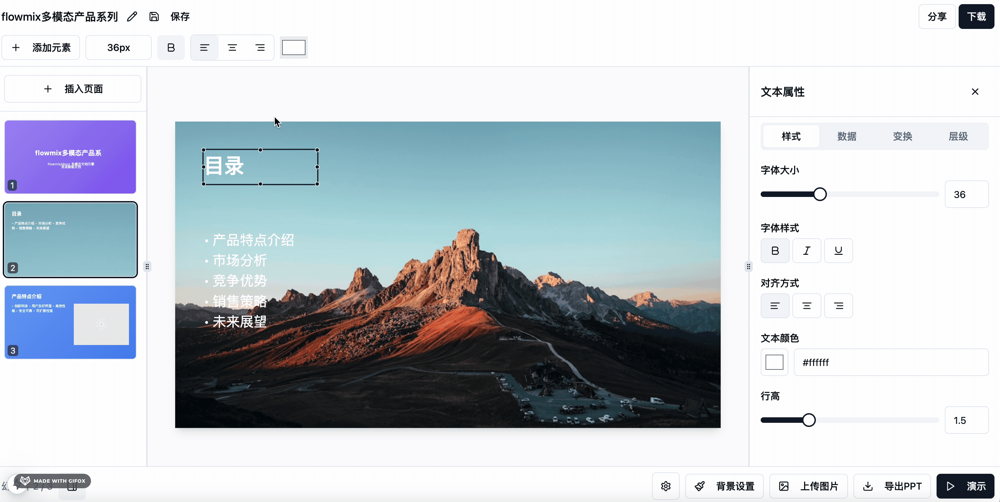

# pptx
A PPT online editor based on the web terminal ｜ 一款基于web端的ppt在线编辑器

项目完全开源，开源不易，可以点个【star】支持一下哦～

## 技术栈

- Nextjs
- @radix-ui
- tailwindcss
- html2canvas
- recharts
- 自研PPT结构转换算法

## 功能模块

- 多组件支持（图文，形状，表格，可视化图表等）
- 自定义画布
- 动态可配置属性面板
- PPT演示功能
- 组件可视化拖拽
- PPT导出功能

## Импорт JSON (PPTX→JSON)

1. Скопируйте выходные данные импортёра в `public/imports/test1`:
   - `public/imports/test1/doc.json`
   - папки `public/imports/test1/backgrounds` и `public/imports/test1/assets` (если нужны).
2. Запустите проект (`npm run dev`).
3. В редакторе нажмите кнопку **Импорт** в верхней панели.
4. Во вкладке **URL** введите `/imports/test1/doc.json` и подтвердите импорт.

## Проверка round-trip ZIP (PPTX→out.zip→out.zip)

1. Запустите проект (`npm run dev`).
2. В редакторе нажмите кнопку **Импорт** и выберите `out.zip`, полученный из конвертора PPTX→out.zip.
3. Проверьте, что текстовые стили совпадают с исходником (цвет, bold/italic/underline, выравнивание, lineHeight/letterSpacing).
4. Нажмите **Сохранить** → скачайте новый `out.zip`.
5. Снова импортируйте сохранённый `out.zip`.
6. Убедитесь, что:
   - визуально ничего не изменилось по сравнению с первым импортом,
   - цвета, bold/italic/underline и align совпадают,
   - SVG-иконки остаются SVG (не ломаются и не превращаются в PNG),
   - элементы не смещаются из-за потери lineHeight/letterSpacing.

关注【趣谈前端】公众号，获取更多技术干货，项目最新进展，和开源实践。

## 在线办公相关解决方案

1. [flowmix/docx多模态文档编辑器](https://flowmix.turntip.cn)
2. [灵语AI文档](https://mindlink.turntip.cn)
3. [H5-Dooring智能零代码平台](https://github.com/MrXujiang/h5-Dooring)
